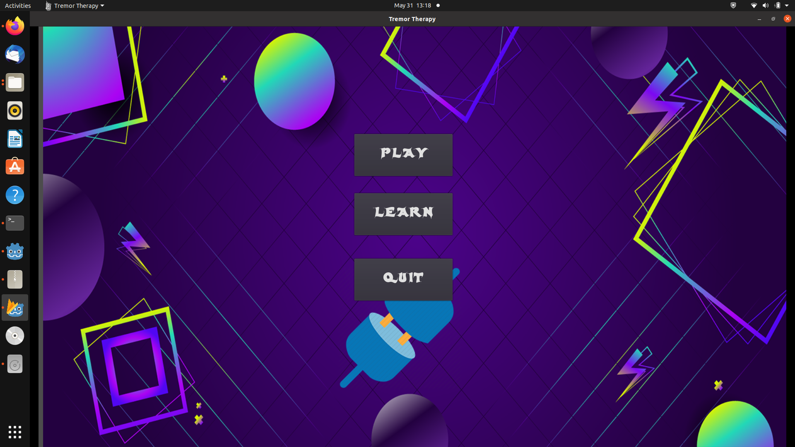
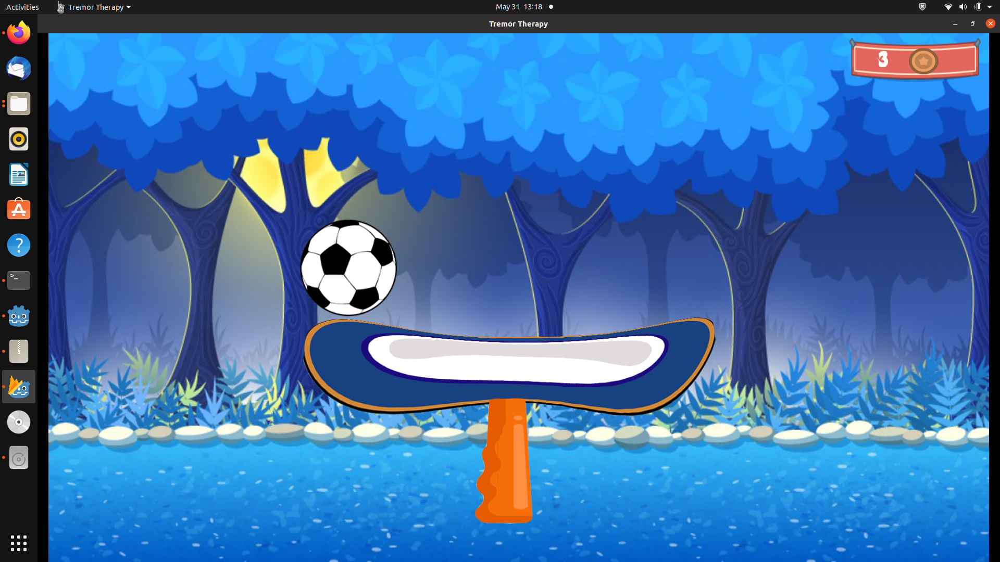
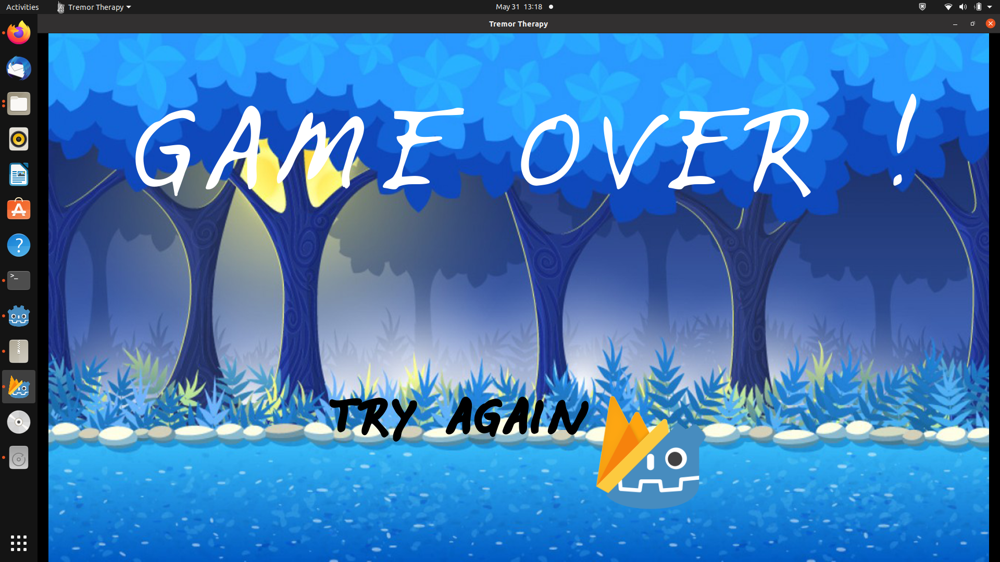
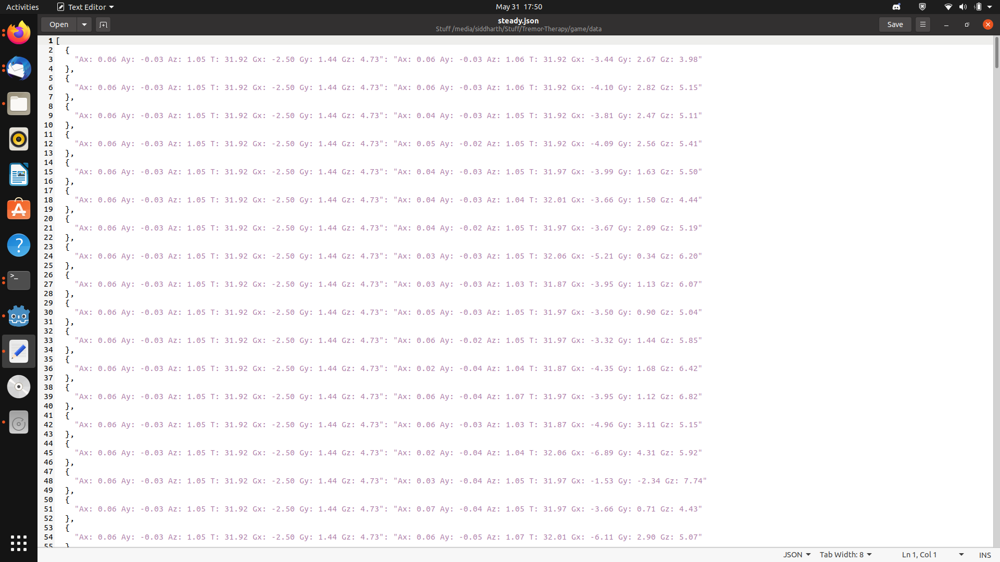

# Tremor-Therapy

**Overview**

Tremor Therapy is an interactive game using developed for helping children and teens with their therapy process for Tremors(Shaky Hands). It is intended to give the teraphist or doctor complete analytics about the ppatients by managing them remotely. Please feel free to start this repo and PR for better changes.

**Motivation**

We were motivated to build this project by the increasing discompforatablility of therapist and doctors of not able to treat their patients because of the cureent locdown and COVID-19 safety measures. Thousands of children undergoing issue after accidents, brain surgery, parkinson's disease , etc.. are stranded with no help to continue their recovery exercises. After some research we found that gaming are the most effective way of improving children and teens recovery as it makes the process fun and enjoyable.Thus, We wanted to thus build a gaming system that has some hardware at users(patients) end which can be used by the patient for gaming. The intelligent iot device gets the data realtime and helps the patient place games. This data can be further collected and provided to the doctor/therapist for personal analysis.

**Interfaces**

1)Patient(User): Game developed - game files

2)Doctor/Therapist: Android App for personal patients info and their daily gaming statistics - android files

**In this project** (Refactored)

game files of the project

others:

1)design:contains all design related files wrt ui/ux  :Collaborated by **ANAS**

2)android:contains files related to android application on doctors phone. :Collaborated by **ANAS**

3)hardware:complete work done wrt iot device.  :Collaborated by **RAFI**

**Software Used**

1)For developing this application we used Godot gaming engine which runs under GDScript language. Here is the documentation and installation link for Godot : https://docs.godotengine.org/en/stable/index.html  and used firebase api for auth purpose.

2)For android app we used firebase as backend and java language for developing the application.

**Hardware Used**

1)NodeMcu - ESP8266

2)MPU6050 - Sensor

**How to deploy?**

1)Download Godot.

2)Go to firebase console and create an project. Use the generated API and navigate to game -> static -> firebase.gd and paste the API in the space given.

3)Run the game files directly using the godot engine and play.

4)For demo you can create an account by registering on main page. But we restrict that this feature is completely available for the doctor only.

**How the game Works?**

1.We first have to login using a username and password:

-> Here is the firebase user auth:

2.We get navigated to homescreen on succesfull authentication:

3.If we click quit we go back to login screen.

4.If we click on learn then we can see instructions from therapists.

5. On clicking play, we are guided to the level and instruction of that level.

6.Now we can proceed to play the game. We need to use the iot devicces and do the action as instructed by the therapist if done properly we can balance the ball and allow it from not falling. If the ball falls we still have lives. Total 3 lives in a try. If all 3 lives lost then we need to start over. If won we can lead to next level.

7. If we fail in 3rd try the game is over and we get this screen:

8. If you want to register we have a main page for that:

**JSON format of data we recive through our IOT device**

**FEEL FREE TO FORK THIS PROJECT AND USE IT FOR YOUR MEDICAL PURPOSES**

